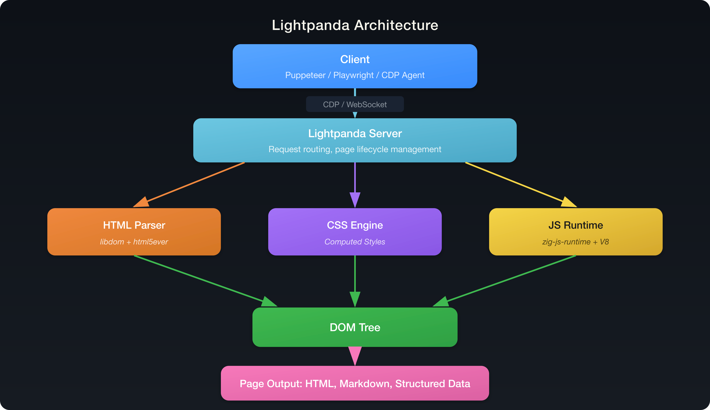

<p align="center">
  <a href="https://lightpanda.io"></a>
</p>
<h1 align="center">Lightpanda Browser</h1>
<p align="center">
<strong>The headless browser built from scratch for AI agents and automation.</strong><br>
Not a Chromium fork. Not a WebKit patch. A new browser, written in Zig.
</p>

</div>
<div align="center">

[](https://github.com/lightpanda-io/browser/blob/main/LICENSE)
[](https://twitter.com/lightpanda_io)
[](https://github.com/lightpanda-io/browser)
[](https://discord.gg/K63XeymfB5)

</div>
<div align="center">

[
](https://github.com/lightpanda-io/demo)
&emsp;
[
](https://github.com/lightpanda-io/demo)
</div>

## Table of Contents

- [Benchmarks](#benchmarks)
- [Quick Start](#quick-start)
  - [Install](#install)
  - [Dump a URL](#dump-a-url)
  - [Start a CDP Server](#start-a-cdp-server)
  - [Telemetry](#telemetry)
- [Lightpanda vs Headless Chrome](#lightpanda-vs-headless-chrome)
  - [What Lightpanda supports today](#what-lightpanda-supports-today)
- [Use Cases](#use-cases)
- [Architecture](#architecture)
- [Why Lightpanda?](#why-lightpanda)
- [Build from Source](#build-from-source)
- [Test](#test)
- [Contributing](#contributing)
- [Compatibility Note](#compatibility-note)
- [FAQ](#faq)

---

## Benchmarks

_Puppeteer requesting 100 pages from a local website on an AWS EC2 m5.large instance. See [benchmark details](https://github.com/lightpanda-io/demo)._

| Metric | Lightpanda | Headless Chrome | Difference |
| :---- | :---- | :---- | :---- |
| Memory (peak, 100 pages) | 24 MB | 207 MB | ~9x less |
| Execution time (100 pages) | 2.3s | 25.2s | ~11x faster |

---

## Quick start

### Install
**Install from the nightly builds**

You can download the last binary from the [nightly
builds](https://github.com/lightpanda-io/browser/releases/tag/nightly) for
Linux x86_64 and MacOS aarch64.

*For Linux*
```console
curl -L -o lightpanda https://github.com/lightpanda-io/browser/releases/download/nightly/lightpanda-x86_64-linux && \
chmod a+x ./lightpanda
```

*For MacOS*
```console
curl -L -o lightpanda https://github.com/lightpanda-io/browser/releases/download/nightly/lightpanda-aarch64-macos && \
chmod a+x ./lightpanda
```

*For Windows + WSL2*

The Lightpanda browser is compatible to run on windows inside WSL. Follow the Linux instruction for installation from a WSL terminal.
It is recommended to install clients like Puppeteer on the Windows host.

**Install from Docker**

Lightpanda provides [official Docker
images](https://hub.docker.com/r/lightpanda/browser) for both Linux amd64 and
arm64 architectures.
The following command fetches the Docker image and starts a new container exposing Lightpanda's CDP server on port `9222`.
```console
docker run -d --name lightpanda -p 9222:9222 lightpanda/browser:nightly
```

### Dump a URL

```console
./lightpanda fetch --obey_robots --log_format pretty  --log_level info https://demo-browser.lightpanda.io/campfire-commerce/
```

<details>
<summary>Example output</summary>

```console
INFO  telemetry : telemetry status . . . . . . . . . . . . .  [+0ms]
      disabled = false

INFO  page : navigate . . . . . . . . . . . . . . . . . . . . [+6ms]
      url = https://demo-browser.lightpanda.io/campfire-commerce/
      method = GET
      reason = address_bar
      body = false
      req_id = 1

INFO  browser : executing script . . . . . . . . . . . . . .  [+118ms]
      src = https://demo-browser.lightpanda.io/campfire-commerce/script.js
      kind = javascript
      cacheable = true

INFO  http : request complete . . . . . . . . . . . . . . . . [+140ms]
      source = xhr
      url = https://demo-browser.lightpanda.io/campfire-commerce/json/product.json
      status = 200
      len = 4770

INFO  http : request complete . . . . . . . . . . . . . . . . [+141ms]
      source = fetch
      url = https://demo-browser.lightpanda.io/campfire-commerce/json/reviews.json
      status = 200
      len = 1615
<!DOCTYPE html>
```

</details>

### Start a CDP server

```console
./lightpanda serve --obey_robots --log_format pretty  --log_level info --host 127.0.0.1 --port 9222
```

<details>
<summary>Example output</summary>

```console
INFO  telemetry : telemetry status . . . . . . . . . . . . .  [+0ms]
      disabled = false

INFO  app : server running . . . . . . . . . . . . . . . . .  [+0ms]
      address = 127.0.0.1:9222
```

</details>

Once the CDP server started, you can run a Puppeteer script by configuring the
`browserWSEndpoint`.

<details>
<summary>Example Puppeteer script</summary>

```js
'use strict'

import puppeteer from 'puppeteer-core';

// use browserWSEndpoint to pass the Lightpanda's CDP server address.
const browser = await puppeteer.connect({
  browserWSEndpoint: "ws://127.0.0.1:9222",
});

// The rest of your script remains the same.
const context = await browser.createBrowserContext();
const page = await context.newPage();

// Dump all the links from the page.
await page.goto('https://demo-browser.lightpanda.io/amiibo/', {waitUntil: "networkidle0"});

const links = await page.evaluate(() => {
  return Array.from(document.querySelectorAll('a')).map(row => {
    return row.getAttribute('href');
  });
});

console.log(links);

await page.close();
await context.close();
await browser.disconnect();
```

</details>

### Telemetry
By default, Lightpanda collects and sends usage telemetry. This can be disabled by setting an environment variable `LIGHTPANDA_DISABLE_TELEMETRY=true`. You can read Lightpanda's privacy policy at: [https://lightpanda.io/privacy-policy](https://lightpanda.io/privacy-policy).

## Lightpanda vs Headless Chrome

Lightpanda is not a general-purpose browser. It is built specifically for headless workloads.

**Use Lightpanda when you need:**

- Low-memory scraping or data extraction at scale
- AI agent browsing (via MCP or CDP)
- Fast CI test runs against a headless browser
- Markdown/text extraction from JS-rendered pages
- Minimal footprint: single binary, no Chromium install

**Use Headless Chrome when you need:**

- Full visual rendering, screenshots, or PDFs
- WebGL or advanced CSS layout
- Complete Web API coverage (Canvas, WebRTC, etc.)
- Pixel-perfect visual testing

### What Lightpanda supports today

- HTTP loader ([Libcurl](https://curl.se/libcurl/))
- HTML parser ([html5ever](https://github.com/servo/html5ever))
- DOM tree + DOM APIs
- Javascript ([v8](https://v8.dev/))
- Ajax (XHR + Fetch)
- CDP/WebSocket server
- Click, input/form, cookies
- Custom HTTP headers
- Proxy support
- Network interception
- robots.txt compliance (`--obey_robots`)

**Note:** There are hundreds of Web APIs. Coverage increases with each release. If you hit a gap, [open an issue](https://github.com/lightpanda-io/browser/issues).

## Use Cases

### AI Agents and LLM Tools

Give your AI agent a real browser that is fast and cheap to run. Lightpanda Cloud exposes an MCP endpoint at `cloud.lightpanda.io/mcp/sse` with tools for search, goto, markdown, and links. Works with Claude, Cursor, Windsurf, or any CDP-based agent framework.

- [agent-skill repo](https://github.com/lightpanda-io/agent-skill)

### Web Scraping and Data Extraction

Lightpanda uses 9x less memory than Chrome. It works with Crawlee, Puppeteer, and Playwright.

```console
lightpanda fetch --dump markdown --obey_robots https://example.com
```

### Automated Testing

Drop-in replacement for headless Chrome in CI pipelines. If your tests use Puppeteer or Playwright, change the connection URL to `ws://127.0.0.1:9222` and run them.

### LLM Training Data Collection

Use `--dump markdown` to extract clean text from JS-rendered pages at volume.

---

## Architecture



The client connects over CDP via WebSocket. The server parses HTML into a DOM tree, applies CSS, and executes JavaScript through V8. Page content is returned to the client as HTML, markdown, or structured data depending on the request.

---

## Why Lightpanda?

### Javascript execution is mandatory for the modern web

Simple HTTP requests used to be enough for scraping. That's no longer the case. Javascript now drives most of the web:

- Ajax, Single Page Apps, infinite loading, instant search
- JS frameworks: React, Vue, Angular, and others

### Chrome is not the right tool

Running a full desktop browser on a server works, but it does not scale well. Chrome at hundreds or thousands of instances is expensive:

- Heavy on RAM and CPU
- Hard to package, deploy, and maintain at scale
- Many features are irrelevant in headless usage

### Lightpanda is built for performance

Supporting Javascript with real performance meant building from scratch rather than forking Chromium:

- Not based on Chromium, Blink, or WebKit
- Written in Zig, a low-level language with explicit memory control
- No graphical rendering engine

---

## Build from Source

### Prerequisites

Lightpanda is written with [Zig](https://ziglang.org/) `0.15.2` and depends on: [v8](https://chromium.googlesource.com/v8/v8.git), [Libcurl](https://curl.se/libcurl/), [html5ever](https://github.com/servo/html5ever).

**Debian/Ubuntu:**

```
sudo apt install xz-utils ca-certificates \
    pkg-config libglib2.0-dev \
    clang make curl git
```
You also need to [install Rust](https://rust-lang.org/tools/install/).

**Nix:**

```
nix develop
```

**macOS:**

```
brew install cmake
```

You also need [Rust](https://rust-lang.org/tools/install/).

### Build and run

Build the browser:

```
make build       # release
make build-dev   # debug
```

Or directly: `zig build run`.

#### Embed v8 snapshot

Generate the snapshot:

```
zig build snapshot_creator -- src/snapshot.bin
```

Build using the snapshot:

```
zig build -Dsnapshot_path=../../snapshot.bin
```

See [#1279](https://github.com/lightpanda-io/browser/pull/1279) for details.

---

## Test

### Unit Tests

```
make test
```

### End to End Tests

Clone the [demo repository](https://github.com/lightpanda-io/demo) into `../demo`. Install the [demo's node requirements](https://github.com/lightpanda-io/demo?tab=readme-ov-file#dependencies-1) and [Go](https://go.dev) >= v1.24.

```
make end2end
```

### Web Platform Tests

Lightpanda is tested against the standardized [Web Platform Tests](https://web-platform-tests.org/) using [a fork](https://github.com/lightpanda-io/wpt/tree/fork) with a custom [`testharnessreport.js`](https://github.com/lightpanda-io/wpt/commit/01a3115c076a3ad0c84849dbbf77a6e3d199c56f).

You can also run individual WPT test cases in your browser via [wpt.live](https://wpt.live).

**Setup WPT HTTP server:**

```
git clone -b fork --depth=1 git@github.com:lightpanda-io/wpt.git
cd wpt
./wpt make-hosts-file | sudo tee -a /etc/hosts
./wpt manifest
```

See the [WPT setup guide](https://web-platform-tests.org/running-tests/from-local-system.html) for details.

**Run WPT tests:**

Start the WPT HTTP server:

```
./wpt serve
```

Run Lightpanda:

```
zig build run -- --insecure_disable_tls_host_verification
```

Run the test suite (from [demo](https://github.com/lightpanda-io/demo/) clone):

```
cd wptrunner && go run .
```

Run a specific test:

```
cd wptrunner && go run . Node-childNodes.html
```

Options: `--summary`, `--json`, `--concurrency`.

**Note:** The full suite takes a long time. Build with `zig build -Doptimize=ReleaseFast run` for faster test execution.

---

## Contributing

See [CONTRIBUTING.md](https://github.com/lightpanda-io/browser/blob/main/CONTRIBUTING.md) for guidelines.

You must sign our [CLA](CLA.md) during the pull request process.

- [Good first issues](https://github.com/lightpanda-io/browser/labels/good%20first%20issue)
- [Discord](https://discord.gg/K63XeymfB5)

---

## Compatibility Note

**Playwright compatibility note:** A Playwright script that works today may break after a Lightpanda update. Playwright selects its execution strategy based on which browser APIs are available. When Lightpanda adds a new [Web API](https://developer.mozilla.org/en-US/docs/Web/API), Playwright may switch to a code path that uses features not yet implemented. We test for compatibility, but cannot cover every scenario. If you hit a regression, [open a GitHub issue](https://github.com/lightpanda-io/browser/issues) and include the last version of the script that worked.

---

## FAQ

<details>
<summary><strong>Q: What is Lightpanda?</strong></summary>

Lightpanda is an open-source headless browser written in Zig. It targets AI agents, web scraping, and automated testing. It uses 9x less memory and runs 11x faster than headless Chrome.

</details>

<details>
<summary><strong>Q: How does Lightpanda compare to Headless Chrome?</strong></summary>

About 24 MB peak memory vs 207 MB for Chrome when loading 100 pages via Puppeteer. Task completion: 2.3s vs 25.2s. It supports the same CDP protocol, so most Puppeteer and Playwright scripts work without code changes. See the [Lightpanda vs Headless Chrome](#lightpanda-vs-headless-chrome) section for what Lightpanda can and cannot do.

</details>

<details>
<summary><strong>Q: Is Lightpanda a Chromium fork?</strong></summary>

No. It is written in Zig and implements web standards independently (W3C DOM, CSS, JavaScript via V8).

</details>

<details>
<summary><strong>Q: Does Lightpanda work with Playwright?</strong></summary>

Yes. Connect with `chromium.connectOverCDP("ws://127.0.0.1:9222")` locally, or use a cloud endpoint for managed infrastructure. See the [compatibility note](#compatibility-note) for caveats.

</details>

<details>
<summary><strong>Q: Is there a cloud/hosted version?</strong></summary>

Yes. [console.lightpanda.io](https://console.lightpanda.io) provides managed browser infrastructure with regional endpoints (EU West, US West), MCP integration, and both Lightpanda and Chromium browser options.

</details>

<details>
<summary><strong>Q: Why is Lightpanda written in Zig?</strong></summary>

Zig provides precise memory control and deterministic performance without a garbage collector. It compiles to a single static binary with no runtime dependencies. Learn more: [Why We Built Lightpanda in Zig](https://lightpanda.io/blog/posts/why-we-built-lightpanda-in-zig).

</details>

<details>
<summary><strong>Q: What operating systems does Lightpanda support?</strong></summary>

Linux (Debian 12, Ubuntu 22.04/24.04), macOS 13+, and Windows 10+ via WSL2.

</details>

<details>
<summary><strong>Q: Does Lightpanda respect robots.txt?</strong></summary>

Yes, when the `--obey_robots` flag is enabled.

</details>
